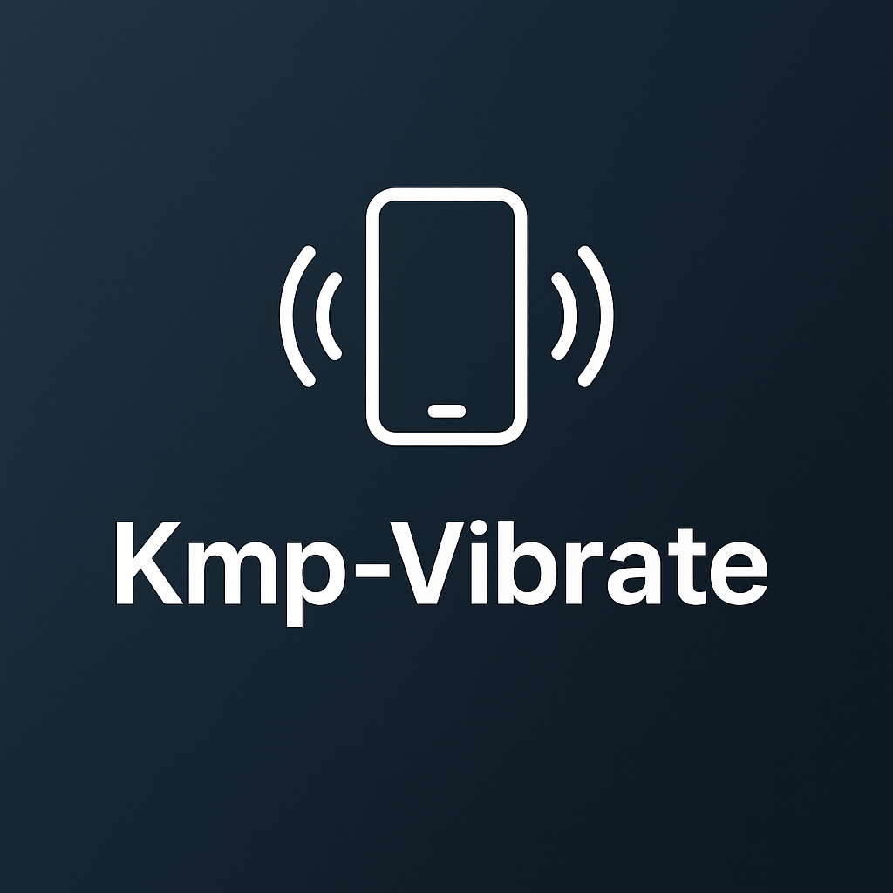

# KMP Vibrate

Kotlin Multiplatform utility library for vibrate📱!


## How to Install

In `lib.versions.toml`  include this dependency version catalog

```toml
[versions]
vibrate = "1.0.0-beta01"

[libraries]
vibrate = { module = "io.github.jmseb3:vibrate", version.ref = "vibrate" }
```

```kotlin
commonMain.dependencies {
    implementation(libs.vibrate)
}
```

or In `build.gradle` of app module, include this dependency

```gradle
commonMain.dependencies {
    implementation("io.github.jmseb3:vibrate:1.0.0-beta01")
}
```

## How To Vibrate
initialized `VibratorManager` per platform

> Android need Context

### one Time

use `VibratorManager.vibrate(time:Long)`

if time 3000 = 3 Second

### Pattern

use `VibratorManager.vibratePattern(timings:LongArray)`

if timings is [300,500,700,500]
> 0.3 delay > 0.5 vibrate > 0.7 delay > 0.5 vibrate

### Stop

`VibratorManager.stopVibrate()`

## Run Sample App

- Android: `open project in Android Studio and run the sample app`
- iOS: `open 'sample/iosApp/iosApp.xcodeproj' in Xcode and run the sample app`

